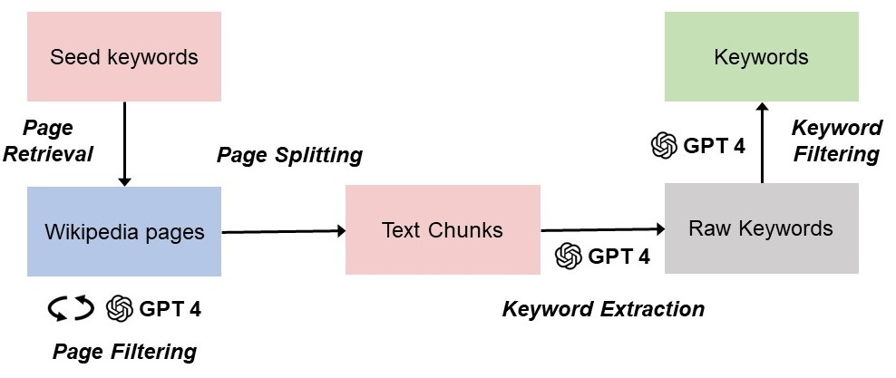

# IsamasRed: Israel-Hamas Conflict Reddit Dataset
## Overview

- Time: August 1 to November 30, 2023
- Number of Submissions (posts): 412,258
- Number of Comments: 8,089,095

## Detail
### Attributes in Submissions
- Subreddit
- id
- author
- timestamp
- title
- text: supplemental text for title
- score: number of upvotes minus downvotes
- upvote_ratio: number of upvotes / (number of upvotes + downvotes)
- upvotes: number of upvotes

### Attributes in Comments
- Subreddit
- id
- text
- author
- timestamp
- submission_id
- controversial: whether is controversial, labeled by Reddit
- score
- ups: number of upvotes
- downs: number of downvotes
- parent_id: last level comment or submission

### Conversations
Each conversation includes one submission with comments. The attribute "comments_df" in the dataset includes all comments information related to the conversation.

## Data Download
All datasets are saved to JSON type files. This repository contains a sample of five hundred submissions, comments, and conversations data, along with an ID file extracted from the complete dataset.  Please contact the author (**kchen035@usc.edu**) to access the entire dataset.

## Keyword Extraction
### Framework

<!--  -->

## Analysis
emotion + moral foundation labeling dataset:
https://drive.google.com/drive/folders/10DJGKjfBe1i_QPrHn1rtByXYgeeBMp4y?usp=sharing
